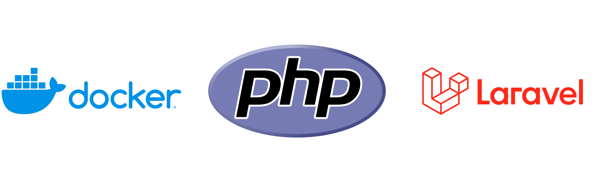

# Dockerized PHP Development Environment for Laravel

<p align="center">
  
</p>

## Description

This environment was specifically created to run some command-line tools from the PHP ecosystem, especially Laravel, without the need to install all the dependencies like PHP, Composer, Laravel, etc., on your local system.

At the end of this documentation, you will find reference links to some specific Docker features that were used.

## Basic Usage

First, build the image:
```sh
$ docker build -t dockerized-php-development-environment-for-laravel:latest .

# The `-t` (or `--tag`) parameter is used to set the name of the image to be created and optionally add a tag to it. In this case, the image name is "dockerized-php-development-environment-for-laravel" and the tag is "latest".
```

Then, run the container:
```sh
$ docker run -d -v "/your/current/work/path:/root/workspace" --network host dockerized-php-development-environment-for-laravel

# The `-d` (or `--detach`) parameter is used to run the container in the background. If it's not specified, your terminal will display the container's logs while it is running.

# The `-v` (or `--volume`) parameter is used to map a directory from the host system (in this case, `/your/current/work/path`) into the container (at `/root`). This allows files from the local directory to be accessed and modified by the container, ensuring changes made inside the container are reflected on the host system.

# The `--network` parameter is used to connect the container to a Docker virtual network, allowing communication between containers or between the containers and the host machine. In this case, we are connecting the container to the default `host` network, which allows the container to access the local network (localhost) of the host machine. This facilitates communication, for example, with databases running on the host machine.
```

The `/root/workspace` directory is initialized as an empty directory inside the container. When a volume is mapped to it, the local directory you define as a volume will share its content with the container. Any changes made in the volume will reflect in the container and vice-versa.

Once the container is running, you're all set to start using it. To access it, do the following:
```sh
# Run
$ docker ps

# It will return something like this:
CONTAINER ID   IMAGE                                    COMMAND               CREATED         STATUS         PORTS     NAMES
2c8c8986e0eb   dockerized-php-development-environment-for-laravel   "tail -f /dev/null"   7 seconds ago   Up 6 seconds             peaceful_napier

# Copy the value returned in the `CONTAINER ID` column in the same line where the `IMAGE` column is named `dockerized-php-development-environment-for-laravel` and use it like in the example below
$ docker exec -it 2c8c8986e0eb bash
```

## More Options

### Changing the version of dependencies configured in the container during the build process

If you want to change the version of any dependencies like PHP, NVM, or NodeJS, pass the `--build-arg` parameter for each argument available in the Dockerfile that you want to change, as shown in the example below:

```sh
$ docker build \
$  --build-arg BUILD_NVM_VERSION=v0.40.1 \
$  --build-arg BUILD_NODEJS_VERSION=v22.12.0 \
$  --build-arg BUILD_PHP_VERSION=8.4 \
$  -t dockerized-php-development-environment-for-laravel:latest
```

### Simplifying the definition of the container's `volume`

If your terminal is already open in the directory that will serve as the volume for the `/root/workspace` directory of the container, you can use the `$(pwd)` command instead of specifying the full path to define this parameter like this:

```sh
$ docker run -d -v "$(pwd):/root/workspace" --network host dockerized-php-development-environment-for-laravel

# `$(pwd)` is a command that returns the current directory in the terminal. This is useful when you want to mount the directory you're working in directly into the container, ensuring that changes made locally are reflected inside the container environment.
```

## Reference Links

- [Docker volumes](https://docs.docker.com/engine/storage/volumes/)
- [Docker networks](https://docs.docker.com/engine/network/)
- [`docker build` command](https://docs.docker.com/reference/cli/docker/build-legacy/)
- [`docker run` command](https://docs.docker.com/reference/cli/docker/container/run/)
- [`docker ps` command](https://docs.docker.com/reference/cli/docker/container/ls/)
- [`docker exec` command](https://docs.docker.com/reference/cli/docker/container/exec/)
